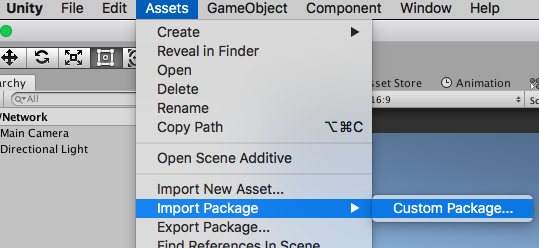
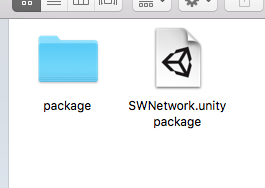
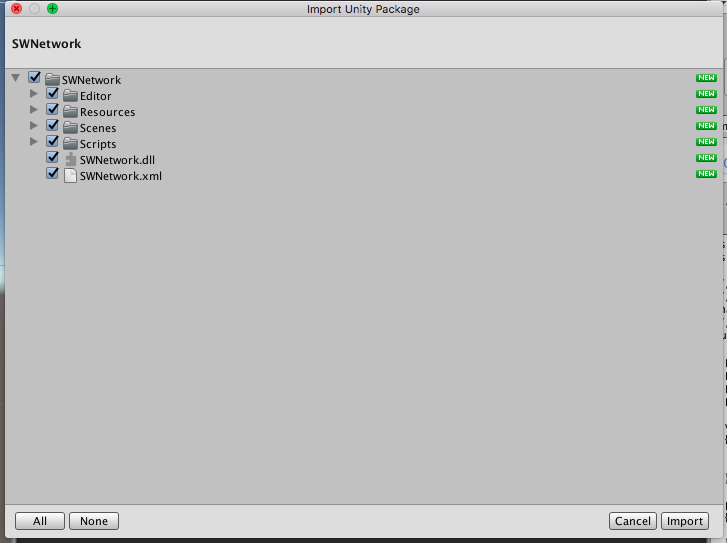
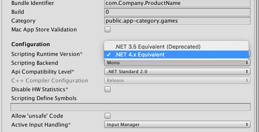
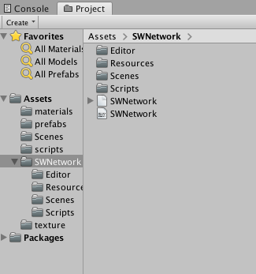

# Custom Unity Package
<small>This guide covers how to install the SWNetwork custom package in Unity.</small>
___

## Download

The SWNetwork.unitypackage can be found on the SDK download page. https://www.socketweaver.com/download.html

## Install the SWNetwork.unitypackage

<small>Installing the package is simple using Unity Editor.</small>

1. Select **Assets**->**Import Package**->**Custom Package..**

2. Choose SWNetwork.unitypackage in your local file system.

3. Select all the items in the **Import Unity Package** window and click **Import**. 

4. Select **File**->**Build Settings**->**Player Settings...**->**Other Settings**->**Configuration** and make sure Scripting Runtime Version is set to .NET 4.x Equivalent in the PlayerSettings.

5. SWNetwork libraries will be installed under the SWNetwork directory in you project.

