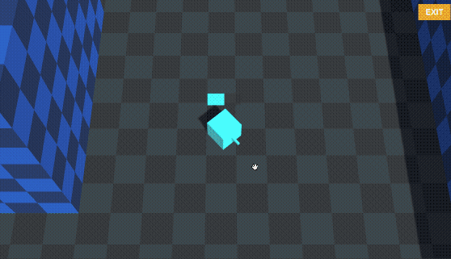

# Top-Down Shooter
___

## Requirements

* **Unity 2018.3.4 or later**. You can download the latest version of Unity here: https://unity3d.com/get-unity/download
* **A SocketWeaver Account**. You can create a SocketWeaver Account for free here: https://portal.socketweaver.com

!!! note ""
    All accounts get 20GB of data for free every month. 

## What we are making

In this tutorial, we are going to make a multiplayer top-down shooter.

We will show you the process step-by-step. By the time you finished reading this tutorial, you will be ready to start converting your own game or explore more advanced features that our Unity SDK provides.

## Source Code

The source code of this tutorial is hosted at: https://github.com/SocketWeaver/third-person

## The repository has two Unity Projects:

### Starter

The starter project of the tutorial. It has all the assets you need to complete the tutorial. 

The Starter Project has one scene: Game scene.

### Game scene

You can use the **WASD** keys or the **Arrow** keys to move the cube around. Pressing the **Space** key makes the cube jump. **Mouse movement** controls the cube's direction. **Mouse Left Click** fires bullets.

### Final

The final playable multiplayer game.

## Community

If you have questions about the tutorial, join our Discord server: https://discord.gg/qXt7Bkf
