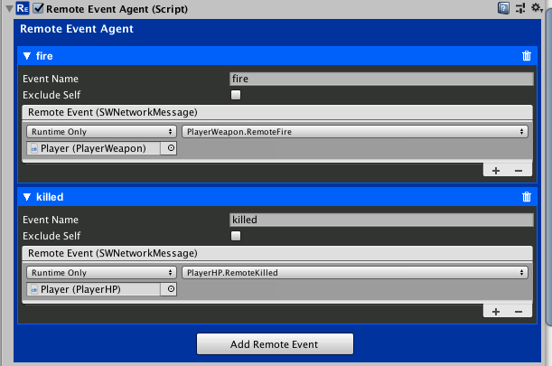
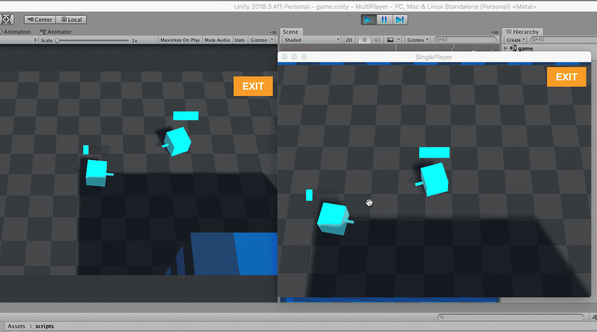

# Player Respawn

<small>3 - 5 minutes read</small>

As the players shoot each other, their hp reaches 0 and stays at 0. You can add another remote event to trigger the player explosion death effect.

## Player Explosion
Add another remote event and name it "killed".

In the PlayerHP.cs Script:

* Add a RemoteEventAgent property and initialize it in the ``Start()`` method.

``` c#
RemoteEventAgent remoteEventAgent;

void Start()
{
    hpSlider.minValue = 0;
    hpSlider.maxValue = maxHp;
​
    networkId = GetComponent<NetworkID>();
    syncPropertyAgent = gameObject.GetComponent<SyncPropertyAgent>();
    remoteEventAgent = gameObject.GetComponent<RemoteEventAgent>();
}
```

* Update the ``OnHpChanged()`` method to invoke the "killed" remote event when hp is 0. 

``` c#
public void OnHpChanged()
{
    // Update the hpSlider when player hp changes
    currentHP = syncPropertyAgent.GetPropertyWithName("hp").GetIntValue();
    hpSlider.value = currentHP;
​
    if (currentHP == 0)
    {
        // invoke the "killed" remote event when hp is 0. 
        if (networkId.IsMine)
        {
            remoteEventAgent.Invoke("killed");
        }
    }
}
```

* Add ``RemoteKilled()`` method to handle the "killed" remote event.

``` c#
public void RemoteKilled()
{
    Instantiate(explode, transform.position, Quaternion.identity);
}
```

* Hook up the event listener in the Editor Inspector. 



!!! tip
    Make sure you applied the changes to the Player Prefab

## Respawning the Player

* In the GameSceneManager.cs script, add the following methods to respawn the player.

``` c#
public void DelayedRespawnPlayer()
{
    // Respawn the player in 1 second
    StartCoroutine(RespawnPlayer(1f));
}

IEnumerator RespawnPlayer(float delayTime)
{
    yield return new WaitForSeconds(delayTime);
    
    // Respawn the player at a random SpawnPoint
    int spawnPointIndex = Random.Range(0, 3);

    NetworkClient.Instance.LastSpawner.SpawnForPlayer(0, spawnPointIndex);
}
```

* In the PlayerHP.cs script, update the RemoteKilled() method.

``` c#
public void RemoteKilled()
{
    Instantiate(explode, transform.position, Quaternion.identity);
​
    // Only the source player GameObject should be respawned. 
    // SceneSpawner will handle the remote duplicate creation for the respawned player.
    if (networkId.IsMine)
    {
        GameSceneManager gameSceneManager = FindObjectOfType<GameSceneManager>();
​
        // Call the DelayedRespawnPlayer() method you just added to the GameSceneManager.cs script. 
        gameSceneManager.DelayedRespawnPlayer();
​
        // Ask the SceneSpawner to destroy the gameObject. 
        // SceneSpawner will destroy the local Player and its remote duplicates.
        NetworkClient.Instance.LastSpawner.DestroyGameObject(gameObject);
    }
}
```

## Play
You can follow the steps in section [Test and Play](test-and-play.md) to test out the changes made in this page.

