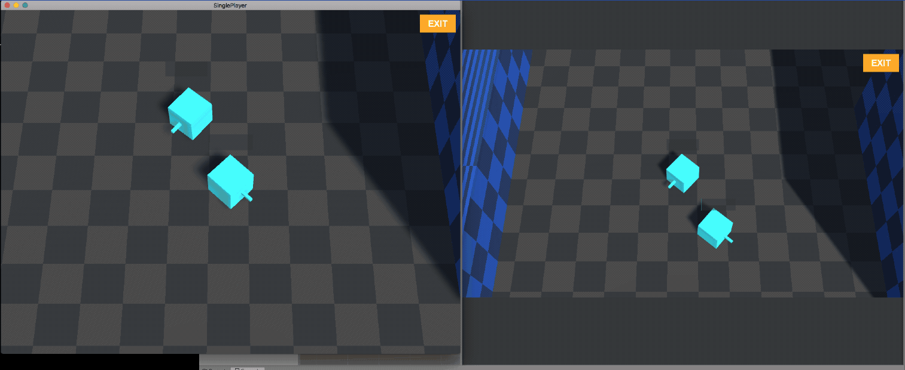
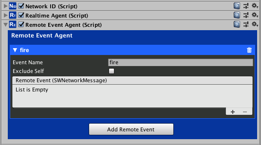
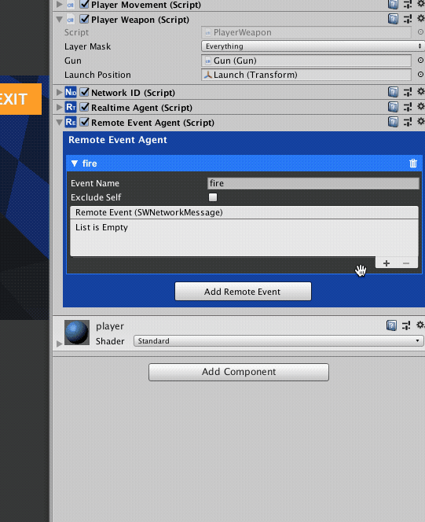
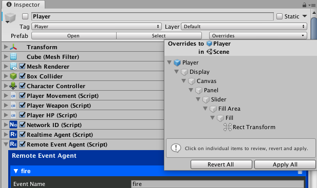
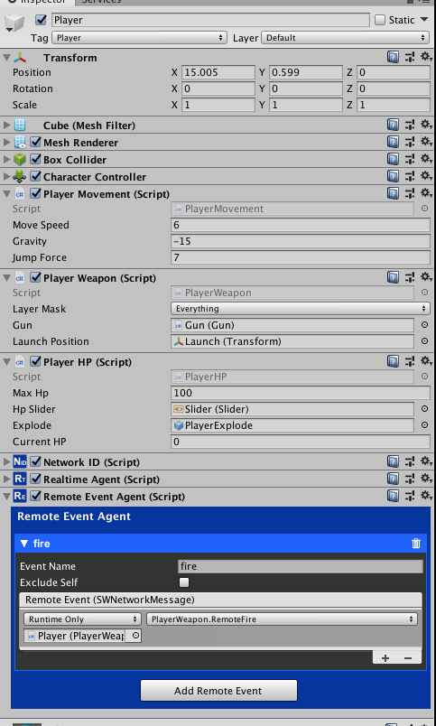
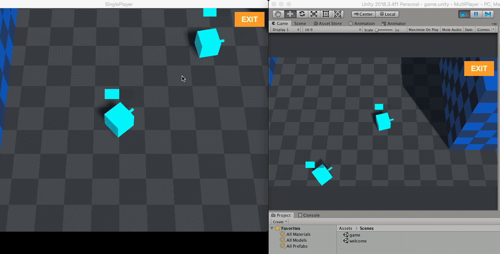

# Remote Events
<small>5 - 10 minutes read</small>
____

It's time for some shooting! You might have noticed that the shooting action is not synced. In this section, you will add a remote event to the Player Prefab to sync player actions.



## RemoteEventAgent

Select the Player Prefab. Click the **Add Component** button and Search "Agent",  select Remote Event Agent to attach it to the Player GameObject.



Click on the **Add Remote Event** button and set the event name to "fire". The event name is used to find and trigger a remote event across different networks. 

!!! warning
    Make sure that remote events in the same RemoteEventAgent have different event names.

The SocketWeaver remote events are super charged Unity events. You can invoke them in scripts. You can add listeners to handle them, and when a remote events is invoked, the listeners of the same remote event in different network will be triggered.

You need to update the PlayerWeapon.cs script to invoke and handle the "fire" event.

Add two properties: networkId, and remoteEventAgent.

``` c#
NetworkID networkId;
RemoteEventAgent remoteEventAgent;
```

Implement the Start() method and initialize the networkId, and remoteEventAgent properties.

``` c#
void Start()
{
    networkId = GetComponent<NetworkID>();
    remoteEventAgent = gameObject.GetComponent<RemoteEventAgent>();
}
```

Only the source GameObject should receive user inputs, we can use the **IsMine** property of **NetworkID** component to find out if the Player GameObject is the source GameObject.

``` c#
void Update()
{
    if (networkId.IsMine)
    {
        // get mouse inputs
        if (Input.GetMouseButtonDown(0))
        {
            // 0.5 seconds interval between shots
            if (!IsInvoking("FireBullet"))
            {
                InvokeRepeating("FireBullet", 0f, 0.5f);
            }
        }
​
        if (Input.GetMouseButtonUp(0))
        {
            CancelInvoke("FireBullet");
        }
    }
}
```

Update the fireBullet() method to invoke the "fire" event. We used SWNetworkMessage to send the bullet launch position(vector3) and aim direction (vector3) along with the "fire" event.

``` c#
void FireBullet()
{
    SWNetworkMessage msg = new SWNetworkMessage();
    msg.Push(launchPosition.position);
    msg.Push(transform.forward);
    remoteEventAgent.Invoke("fire", msg);
}
```

Implement the Event Handler method. We used PopVector3() method on the SWNetworkMessage object to obtain the launch position and aim direction of the fire remote event.

``` c#
public void RemoteFire(SWNetworkMessage msg)
{
    Vector3 position = msg.PopVector3();
    Vector3 direction = msg.PopVector3();
    gun.fireBullet(position, direction);
}
```

The final version of PlayerWeapon.cs script should look like.

``` c#
using UnityEngine;
using SWNetwork;
​
public class PlayerWeapon : MonoBehaviour
{
    // aimable layers
    public LayerMask layerMask;
​
    private Vector3 currentLookTarget = Vector3.zero;
    public Gun gun;
​
    // launch position of bullets
    public Transform launchPosition;
​
    NetworkID networkId;
    RemoteEventAgent remoteEventAgent;
​
    private void Start()
    {
        networkId = GetComponent<NetworkID>();
        remoteEventAgent = gameObject.GetComponent<RemoteEventAgent>();
    }
​
    void FixedUpdate()
    {
        if (networkId.IsMine)
        {
            // find player's cursor position in the environment
            RaycastHit hit;
            Ray ray = Camera.main.ScreenPointToRay(Input.mousePosition);
            Debug.DrawRay(ray.origin, ray.direction * 1000, Color.green);
            if (Physics.Raycast(ray, out hit, 1000, layerMask, QueryTriggerInteraction.Ignore))
            {
                if (hit.point != currentLookTarget)
                {
                    currentLookTarget = hit.point;
                }
            }
​
            // ignore cursor position's y value.
            Vector3 targetPosition = new Vector3(hit.point.x, transform.position.y, hit.point.z);
​
            // calculate player's new rotation
            Quaternion rotation = Quaternion.LookRotation(targetPosition - transform.position);
​
            // lerp
            transform.rotation = Quaternion.Lerp(transform.rotation, rotation, Time.deltaTime * 10.0f);
        }
    }
​
    void Update()
    {
        if (networkId.IsMine)
        {
            // get mouse inputs
            if (Input.GetMouseButtonDown(0))
            {
                // 0.5 seconds interval between shots
                if (!IsInvoking("FireBullet"))
                {
                    InvokeRepeating("FireBullet", 0f, 0.5f);
                }
            }
​
            if (Input.GetMouseButtonUp(0))
            {
                CancelInvoke("FireBullet");
            }
        }
    }
​
    void FireBullet()
    {
        SWNetworkMessage msg = new SWNetworkMessage();
        msg.Push(launchPosition.position);
        msg.Push(transform.forward);
        remoteEventAgent.Invoke("fire", msg);
    }
​
    public void RemoteFire(SWNetworkMessage msg)
    {
        Vector3 position = msg.PopVector3();
        Vector3 direction = msg.PopVector3();
        gun.FireBullet(position, direction);
    }
}
```

Add a listener to the "fire" event. Make sure to select the RemoteFire() method under the Dynamic Parameter Section of the methods list.



!!! tip
    Make sure you applied the changes to the Player Prefab. 



Double check if the player prefab has been saved correctly by inspecting the Player prefab in the */Assets/prefabs* folder. Make sure the RemoteEventAgent is saved and the prefab is enabled.



## Play

!!! tip
    Make sure you disabled the Player GameObject in the Hierarchy.

You can follow the steps in the last section [Test and Play](test-and-play.md) to test out the "fire" remote event.

