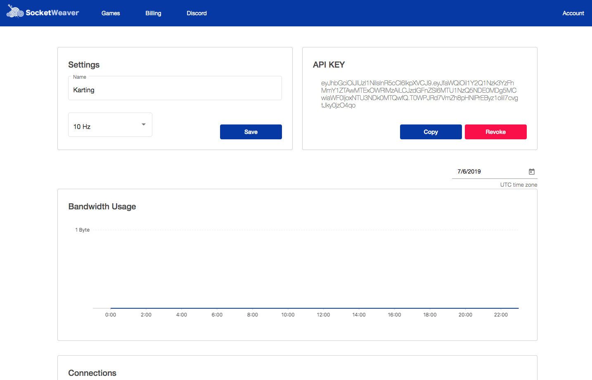
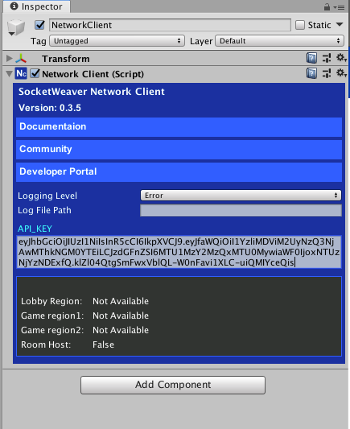
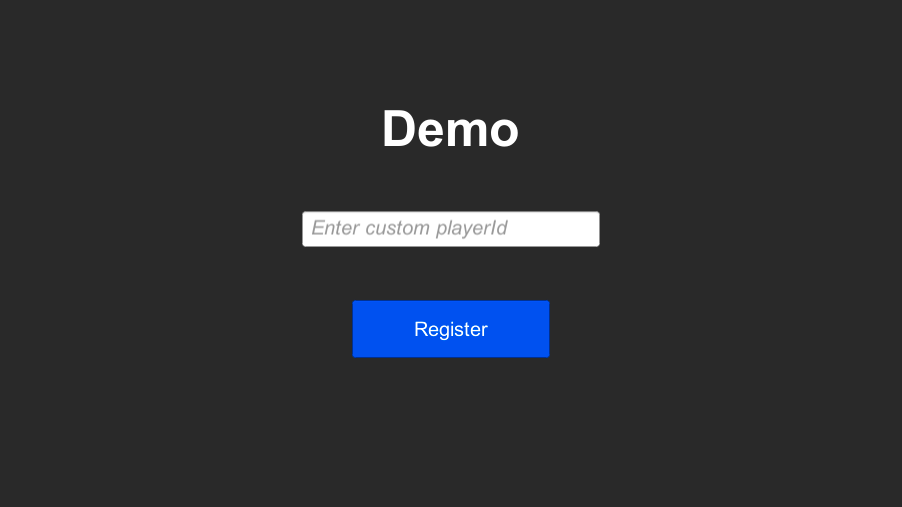
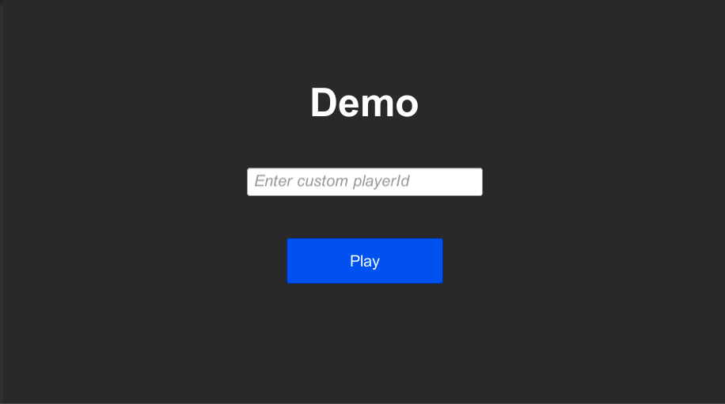

# Setting up the NetworkClient

<small>1 - 3 minutes read</small>
____

## LobbyScene

For simplicity, you are going to use the example LobbyScene included in the SWNetwork package for this tutorial.

The LobbyScene is located at *Assets/SWNetwork/Scenes/LobbyScene*.

The LobbyScene uses the [JoinOrCreate()]() method to get players into rooms quickly. SWNetwork has a rich set of APIs to use for matchmaking. If you want to extend the matchmaking logic of your game further, please visit the Lobby API [documentation]().

## Set up the NetworkClient

>NetworkClient is the entry point of your game to >interact with the SocketWeaver backend services. You >must have one and only one NetworkClient active in >your Scene. 

In the LobbyScene hierarchy, select the **NetworkClient** GameObject. You will notice that a **NetworkClient** component is attached to it. **NetworkClient** has a few properties you can change. For now, you just need to configure its **API_KEY** property to get your game running.

Go to [SocketWeaver Developer Portal](https://portal.socketweaver.com), and create a new game.



Click the **Copy** button to copy the API key to your clipboard, paste it into the **API_KEY** textfield of the **NetworkClient** Component.



To test if everything is working correctly, you can play the LobbyScene. The game view should look like the screenshot below.



If you leave the custom playerId input field empty, LobbyScene will use a randomly generated unique playerId to check into the SocketWeaver services. The generated playerId will be stored in your computer's hard drive, so if you stop playing and play again, the same playerId will be used. The playerId is used to identify a client in the lobby servers and game servers.

By clicking the **Register** button, the LobbyScene sends a request to SocketWeaver, SocketWeaver will validate the API_KEY and route players to a lobby cluster that is geographically closest to them.

Once a player is connected to the assigned lobby cluster, the LobbyScene will automatically register the player to the lobby cluster. The **Play** button should replace the **Register** button now. 



By clicking the **Play** button,  the LobbyScene will try to find a room for the player or create a new room if it cannot find a room in the lobby cluster. By default, when a player is connected to the room's game server, the LobbyScene will load the scene at index 1. You can update it to load the **Game** scene.

``` c#
void HandleConnectedToRoom(bool connected)
{
    if (connected)
    {
        Debug.Log("Connected to room");
        SceneManager.LoadScene("game");
    }
    else
    {
        Debug.Log("Failed to connect to room");
    }
}
```