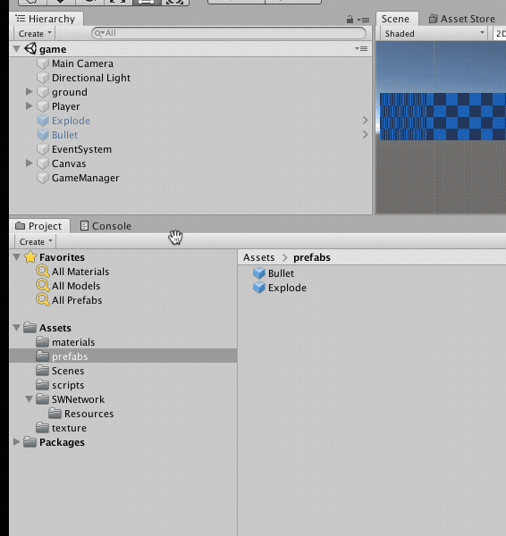
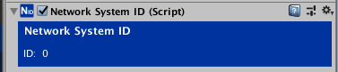
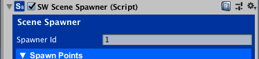
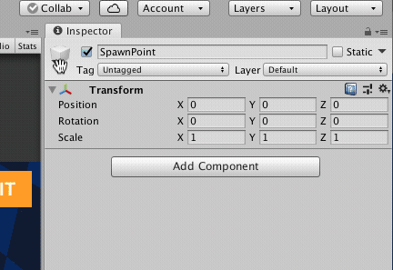
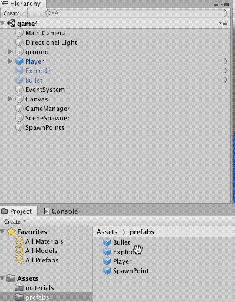
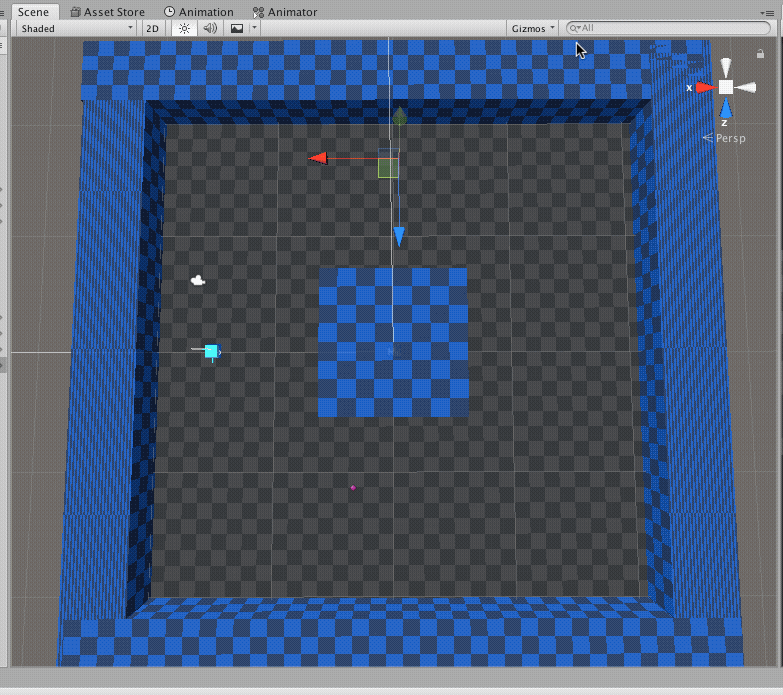
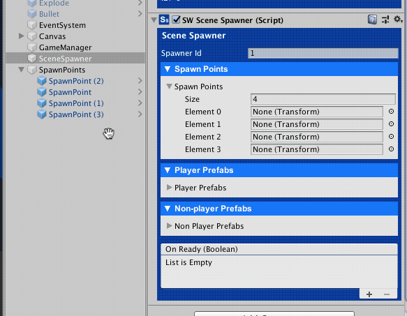
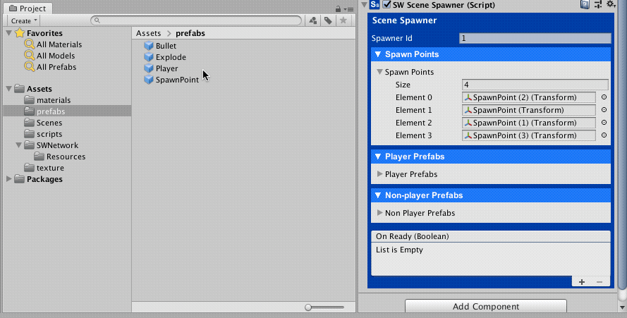
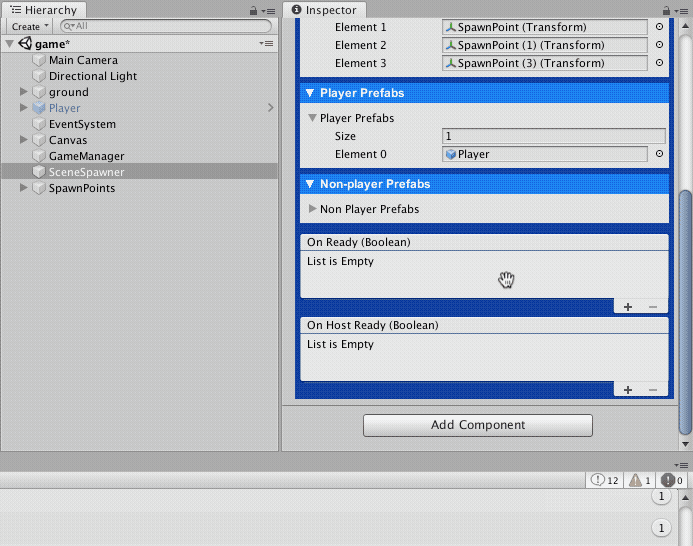

# Setting up the Scene Spawner

<small>5 - 10 minutes read</small>
____

## Player Prefab
At this point, you have the Player **RealTimeAgent** set up. Select the Player GameObject in the Scene Hierarchy and drag it into the Prefabs folder in the Project Assets folder.



## SceneSpawner
Add a new Empty GameObject and name it **SceneSpawner**. Click the Add Component button and Search "Spawner",  select **SceneSpawner** to attach it to the new GameObject.

Note that a **NetworkSystemID** component was attached to SceneSpawner GameObject automatically. **NetworkSystemID** component help SWNetwork to identify SWNetwork's internal GameObjects.



## Choose a unique Spawner Id
The **SceneSpawner** instantiates and destroys Networked GameObjects in a Scene(GameObjects that have a **NetworkID** component). Make sure you give different **SpawnerId** to different **SceneSpawner**s.

Our game only has one **SceneSpawner**, we can set its **SpawnerId** to 1.



## Creating Spawn Points
Create an Empty GameObject and name it **SpawnPoints**, reset its position to (0, 0, 0).

Create an Empty GameObject and name it **SpawnPoint**, and reset its position to (0, 0, 0)as well.

Select an Icon for the SpawnPoint so we can easily find it in the Scene.



Select the **SpawnPoint** GameObject in the Hierarchy and drag it into the Prefabs Folder to create a **SpawnPoint** Prefab. 

Drag the **SpawnPoint** prefab into the **SpawnPoints** GameObject and create 4 **SpawnPoints**.



Move the **SpawnPoint**s to the places you like to spawn the players. Set the Position Y to 1.5 to make sure the players are spawned above the ground.



Select the **SceneSpawner** GameObject, open the **Spawn Point** section and set the Size to 4. Drag the SpawnPoint into the slots.



Adding the Player Prefab to the Scene Spawner
Open the Player Prefabs section of the SceneSpawner, drag the Player Prefab into it.



## Handling the SceneSpawner OnReady Event

Open the GameSceneManager.cs script, and add a method to handle the OnReadyEvent of the SceneSpawner.

Your GameSceneManager.cs script should look like:

``` c#
using UnityEngine.SceneManagement;
using UnityEngine;
using SWNetwork;
​
/// <summary>
/// Game scene manager manages game scenes state.
/// </summary>
public class GameSceneManager : MonoBehaviour
{
    public GameObject winnerPanel;
    public GameObject gameOverPanel;
​
    public void Exit()
    {
        // TODO
        // exit the game
    }
​
    // OnSpawnerReady(bool alreadySetup) method is added to handle the On Ready Event.
    public void OnSpawnerReady(bool alreadySetup)
    {
        Debug.Log("OnSpawnerReady " + alreadySetup);
​
        // Check alreadySetup to see if the scene has been set up before. 
        // If it is true, it means the player disconnected and reconnected to the game. 
        // In this case, we should not spawn a new Player GameObject for the player.
        if (!alreadySetup)
        {
            // If alreadySetup is false, it means the player just started the game. 
            // We randomly select a SpawnPoint and ask the SceneSpawner to spawn a Player GameObject. 
            // we have 1 playerPrefabs so playerPrefabIndex is 0.
            // We have 4 spawnPoints so we generated a random int between 0 to 3.
            int spawnPointIndex = Random.Range(0, 3);
            NetworkClient.Instance.LastSpawner.SpawnForPlayer(0, spawnPointIndex);
​
            // Tell the spawner that we have finished setting up the scene. 
            // alreadySetup will be true when SceneSpawn becomes ready next time.
            NetworkClient.Instance.LastSpawner.PlayerFinishedSceneSetup();
        }
    }
}
```

In the SceneSpawner component, add a listener to the On Ready event. Select OnSpawnerReady(bool) in the GameSceneManager.cs script.

!!! warning ""
    Make sure to select the OnSpawnerReady method from the Dynamic bool section in the list..

