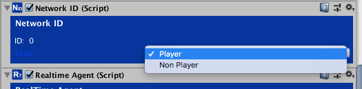
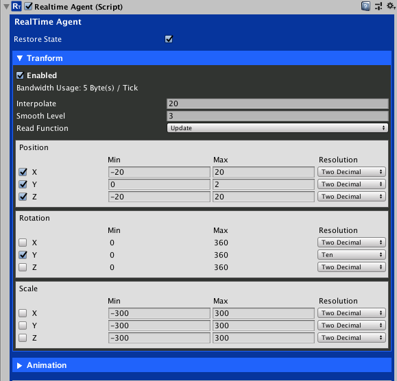

# Sync Player Transform

<small>3 - 5 minutes read</small>
____

## RealTime Agent

Open the game scene, select the Player GameObject in the Hierarchy. 

Click the **Add Component button** and Search "Agent",  select **Realtime Agent** to attach it to the Player GameObject.

You will see that a **NetworkID** component was attached to Player GameObject automatically. **NetworkID** component helps SWNetwork to identify a GameObject. Set its Type to **Player** as the GameObject will be controlled by the players.


​
### Position
* The **RealTimeAgent** send GameObject's position, rotation updates to its remote duplicates.

* The Player GameObject moves in X, Y, Z directions, so we need to enable all of them.

* The **Min**, **Max**, and **Resolution** settings are used to compress the X, Y, Z values.

* In this game, the player moves between -20 to 20 in the X-axis, 0 to 3 in the Y-axis, and -20 to 20 in the Z-axis. You can use these limits to set the compression settings.

### Rotation

* The Player GameObject rotates around the Y-axis. We should enable Y for Rotation. We can set the **resolution** to **Ten** as we do not need high precision for rotation. The Y rotation value that remote duplicates receive will be like: 0, 10, 20 ... 360.

* The **Interpolate** field controls the interpolation of rotation and scale updates. The larger the number the faster the GameObject interpolates to the target rotation and scale.

* The **Smooth Level** field controls the smoothness of position updates. The larger the number the smoother the GameObject moves to the target position. However, a larger smooth level will affect the GameObjects responsiveness.

* The **Read Function** field controls in which function the remote duplicates will read the position updates. 

You can use the settings in the below screenshot to config the RealTime Agent.



## Updating the PlayerMovement.cs script

You need to update the PlayerMovement.cs script so that only the source Player GameObject receives user inputs. Use the **IsMine** property of **NetworkID** to find out if the Player GameObject is the source GameObject.

Also, set the camera to follow the source Player GameObject.

The PlayerMovement.cs script should look like.

``` c#
using UnityEngine;
using SWNetwork;
​
/// <summary>
/// Player movement.
/// </summary>
public class PlayerMovement : MonoBehaviour
{
    public float moveSpeed = 6.0F;
    public float gravity = -15f;
    private float verticalVelocity;
    public float jumpForce = 7.0f;
​
    private CharacterController characterController;
​
    NetworkID networkId;
​
    void Start()
    {
        characterController = GetComponent<CharacterController>();
        networkId = GetComponent<NetworkID>();
​
        if (networkId.IsMine)
        {
            // set CameraFollow target
            Camera m_MainCamera = Camera.main;
            CameraFollow cameraFollow = m_MainCamera.GetComponent<CameraFollow>();
            cameraFollow.target = gameObject;
        }
    }
​
    void Update()
    {
        if (networkId.IsMine)
        {
            // get keyboard inputs
            float speedX = Input.GetAxis("Horizontal") * moveSpeed;
            float speedZ = Input.GetAxis("Vertical") * moveSpeed;
​
            if (characterController.isGrounded)
            {
                verticalVelocity = gravity;
                if (Input.GetKeyDown(KeyCode.Space))
                {
                    Jump();
                }
            }
            else
            {
                verticalVelocity += gravity * Time.deltaTime;
            }
​
            Vector3 movement = new Vector3(speedX, verticalVelocity, speedZ);
            characterController.Move(movement * Time.deltaTime);
        }
    }
​
    public void Jump()
    {
        verticalVelocity = jumpForce;
    }
}
```

## Updating the PlayerWeapon.cs script

Make sure only the GameObject that the local player owns receives mouse movement as well.

The PlayerWeapon.cs script should look like.

``` c#
using UnityEngine;
using SWNetwork;
​
public class PlayerWeapon : MonoBehaviour
{
    // aimable layers
    public LayerMask layerMask;
​
    private Vector3 currentLookTarget = Vector3.zero;
    public Gun gun;
​
    // launch position of bulletes
    public Transform launchPosition;
​
    NetworkID networkId;
​
    private void Start()
    {
        networkId = GetComponent<NetworkID>();
    }
​
    void FixedUpdate()
    {
        if (networkId.IsMine)
        {
            // find player's cursor position in the environment
            RaycastHit hit;
            Ray ray = Camera.main.ScreenPointToRay(Input.mousePosition);
            Debug.DrawRay(ray.origin, ray.direction * 1000, Color.green);
            if (Physics.Raycast(ray, out hit, 1000, layerMask, QueryTriggerInteraction.Ignore))
            {
                if (hit.point != currentLookTarget)
                {
                    currentLookTarget = hit.point;
                }
            }
​
            // ignore cursor position's y value.
            Vector3 targetPosition = new Vector3(hit.point.x, transform.position.y, hit.point.z);
​
            // calculate player's new rotation
            Quaternion rotation = Quaternion.LookRotation(targetPosition - transform.position);
​
            // lerp
            transform.rotation = Quaternion.Lerp(transform.rotation, rotation, Time.deltaTime * 10.0f);
        }
    }
​
    void Update()
    {
        // get mouse inputs
        if (Input.GetMouseButtonDown(0))
        {
            // 0.5 seconds interval between shots
            if (!IsInvoking("FireBullet"))
            {
                InvokeRepeating("FireBullet", 0f, 0.5f);
            }
        }
​
        if (Input.GetMouseButtonUp(0))
        {
            CancelInvoke("FireBullet");
        }
    }
​
    void FireBullet()
    {
        gun.FireBullet(launchPosition.position, transform.forward);
    }
}
```