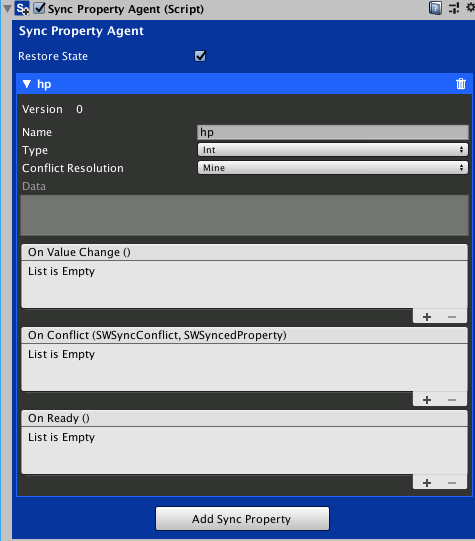
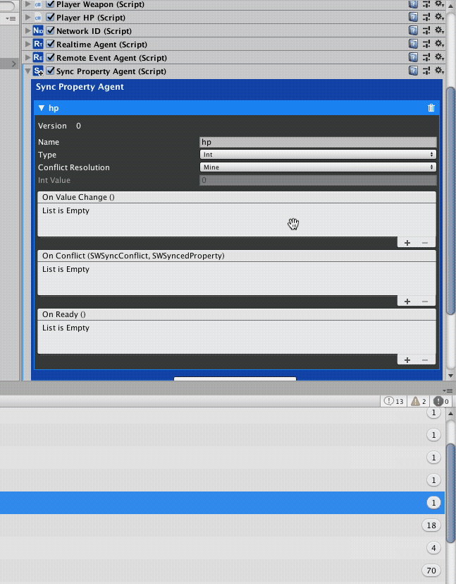
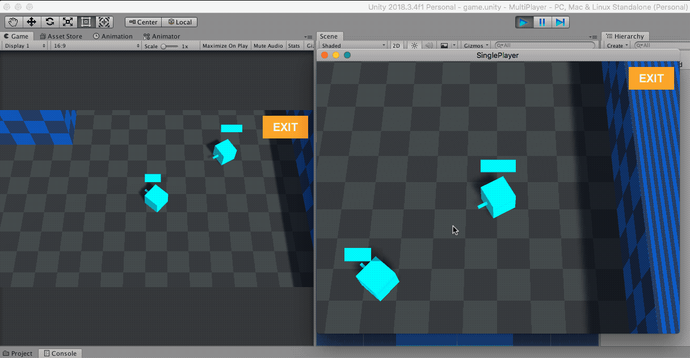

# SyncProperties

<small>5 - 10 minutes read</small>
____

In this section, you will use **SyncProperty** to update player's hp. 

!!! question "Why using SyncProperty"
    SyncProperties are designed for updating states that are not constantly changing. 

    * Only send/receive when the property updates

    * Reliable

    * Supports serializable objects

    * Supports user-defined classes and structs.

    * Supports conflict resolution

## SyncPropertyAgent

Select the Player Prefab. Click the **Add Component** button and Search "Agent",  select Sync Property Agent to attach it to the Player GameObject.


Click the **Add Sync Property** button to create a **SyncProperty** for the Player. The Property's name is important and has to be unique in the same **SyncPropertyAgent** component. Set Name to "hp" and set **Type** to **Int**. The **Conflict Resolution** rule is default to **Mine**. You can use **Mine** for this tutorial. For more information on Conflict Resolution, please visit [Conflict Resolution].



## Updating the PlayerHP.cs Script

### Add two properties: networkId, and syncPropertyAgent.

``` c#
NetworkID networkId;
SyncPropertyAgent syncPropertyAgent;
```

You can remove the currentHP property as the player hp will be stored in the "hp" SyncProperty.

### In the Start() method, and initialize the networkId, and syncPropertyAgent

``` c#
void Start()
{
    networkId = GetComponent<NetworkID>();
    syncPropertyAgent = gameObject.GetComponent<SyncPropertyAgent>();
}
```

### Handling the OnReady SyncProperty Event

``` c#
public void OnHPReady()
{
    Debug.Log("OnHPPropertyReady");
​
    // Get the current value of the "hp" SyncProperty.
    currentHP = syncPropertyAgent.GetPropertyWithName("hp").GetIntValue();
​
    // Check if the local player has ownership of the GameObject. 
    // Source GameObject can modify the "hp" SyncProperty.
    // Remote duplicates should only be able to read the "hp" SyncProperty.
    if (networkId.IsMine)
    {
        int version = syncPropertyAgent.GetPropertyWithName("hp").version;
​
        if (version != 0)
        {
            // You can check the version of a SyncProperty to see if it has been initialized. 
            // If version is not 0, it means the SyncProperty has been modified before. 
            // Probably the player got disconnected from the game. 
            // Set hpSlider's value to currentHP to restore player's hp.
            hpSlider.value = currentHP;
        }
        else
        {
            // If version is 0, you can call the Modify() method on the SyncPropertyAgent to initialize player's hp to maxHp.
            syncPropertyAgent.Modify("hp", maxHp);
            hpSlider.value = maxHp;
        }
    }
    else
    {
        hpSlider.value = currentHP;
    }
}
```

### Updating the GotHit() Method

``` c#
public void GotHit(int damage)
{
    // Only the source GameObject can modify the "hp" SyncProperty.
    if (networkId.IsMine)
    {
        currentHP = syncPropertyAgent.GetPropertyWithName("hp").GetIntValue();
​
        // Check if the player is already dead.
        if (currentHP == 0)
        {
            return;
        }
​
        Debug.Log("Got hit: old currentHP= " + currentHP);
​
        if (currentHP > 0)
        {
            currentHP = currentHP - damage;
            
            // if hp is lower than 0, set it to 0.
            if (currentHP < 0)
            {
                currentHP = 0;
            }
        }
​
        Debug.Log("Got hit: new currentHP= " + currentHP);
​
        // Apply damage and modify the "hp" SyncProperty.
        syncPropertyAgent.Modify("hp", currentHP);
    }
}
```

### Handling the OnChanged SyncProperty Event

``` c#
public void OnHpChanged()
{
    // Update the hpSlider when player hp changes
    currentHP = syncPropertyAgent.GetPropertyWithName("hp").GetIntValue();
    hpSlider.value = currentHP;
}
```

### Adding listeners to the "hp" **SyncProperty**.



!!! tip
    Make sure you applied the changes to the Player Prefab and disabled the Player GameObject in the Hierarchy.

## Play
You can follow the steps in the [Test and Play](test-and-play.md) section to test out the "hp" SyncProperty.



