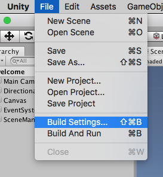
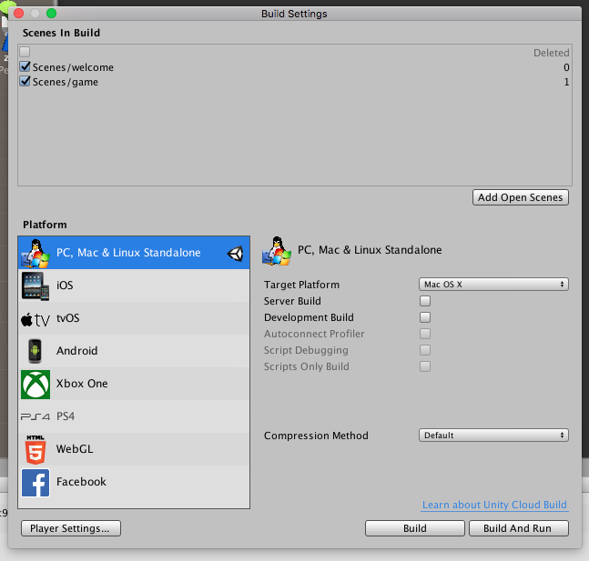
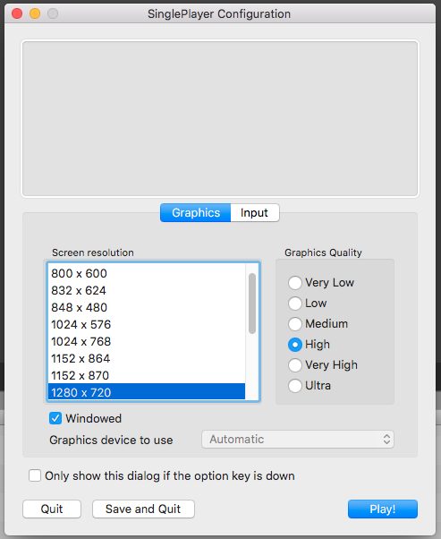
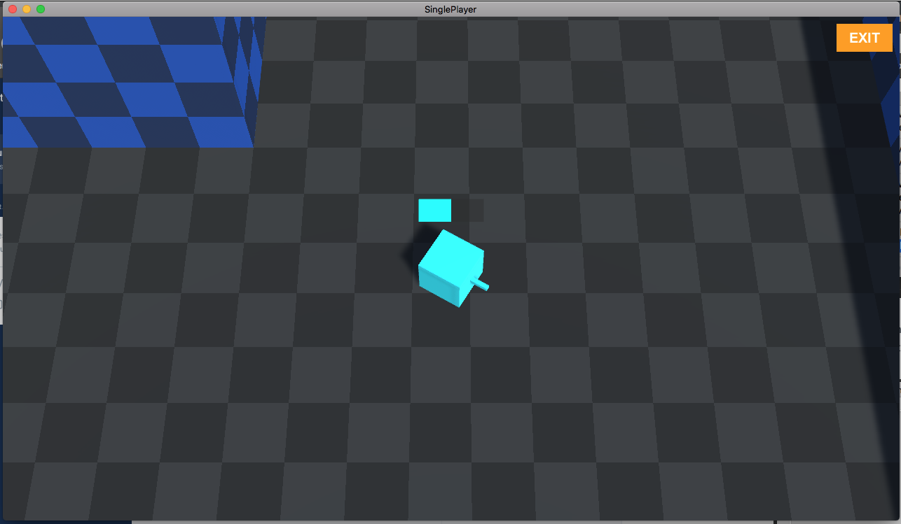
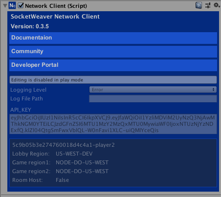

# Test and Play

<small>3 - 5 minutes read</small>
____

At this point, you have set up the Player prefab, configured the **SceneSpawner**, and updated the LobbyScene to load the Game Scene. It's time to have some fun now. Let's build the game and test out what we have created so far.

Disable the Player GameObject in the Game Scene Hierarchy as we want the **SceneSpawner** to create the Players.

## Custom Player Id
SWNetwork generates unique playerId for each game installation. This is for SocketWeaver to identify a client.  If you call the ``NetworkClient.Instance.CheckIn()``method, the generated playerId will be used to check the client into the SocketWeaver services. 

!!! tip
    The first line in the black box is the generated playerId: a9d91dbd-64...

If you use services like Google Firebase to manage user profiles, you can call the ``NetworkClient.Instance.CheckIn(customPlayerId)`` method to overide the generated playerId. 

!!! tip
    You can use the ``NetworkClient.Instance.CheckIn(customPlayerId)`` method for development testing as well.

## Build and Run
* Select **Build Settings...** 

* Make sure you have added the welcome scene and game scene to the game. The welcome scene should have index **0**. The game scene should have index **1**.

* Select **Build** to build the game.

* In the **Game Configuration** window, select the resolution and the Graphics quality you like and enable **Windowed**. Click on the **Play!** button to start the game. 

* The game should launch to the LobbyScene. Enter "player1" as the custom playerId and click the **Register** blue button. You should see the **Play** button replaces the Register button indicating that you have successfully checked-in and are ready to join or create rooms. Click the **Play** button to join or create a room. 

* As there is no room on the lobby server for your game, the local player "player1" will create a new room on the lobby server and become the owner of the new room. The matchmaking logic of the LobbyScene will automatically start the room and connect to the room game server once it is ready. 

The game should load the game scene now.

## Running another client in the Unity Editor

* In the Unity Editor, load the LobbyScene and hit **play**. Enter "player2" as the custom player Id and click the **Register** blue button.

* Notice the playerId in the **NetworkClient** is overridden by the custom playerId you entered.

* Click the **Play** blue button, the "player2" client will try to join or create a room. It will find the room that "player1" created. Since the room has already started,  "player2" will automatically connect to the room game server and load the game scene.

Now you can move around in the scene and try to find "player1"!

!!! success
    Congratulations! You found "player1". 