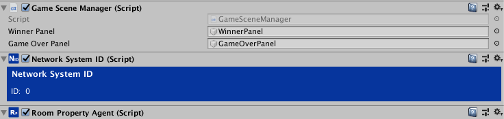

# Updating Room States

<small>3 - 5 minutes read</small>

## RoomPropertyAgent
You have used the **SyncPropertyAgent** to update player properties. The **RoomPropertyAgent** is similar to the SyncPropertyAgent, but it is designed to update room level properties.

* Select the GameManager GameObject in the Scene Hierarchy,

* Click the **Add Component** Button and search for "GameDataManager". Select **RoomPropertyAgent** to Attach it to the GameManager GameObject.



Similar to the **SceneSpawner**, a Network System ID component is attached automatically. You can have multiple RoomPropertyAgents, just make sure you assigned different Agent Id to them.

## Adding the "PlayerScores" SyncProperty

* Click **Add Game Sync Property** button and name the new **SyncProperty** "PlayerScores". Set its **Type** to **Serializable**.

!!! info "Rules for wining the game"
    For this tutorial, the player who killed opponents 3 times is the winner of the game. You can use serializable objects to store player scores.

## GameData and PlayerScore

* Create a new script and call it GameDataModels.cs. 
* Add GameData and PlayerScore Serializable Classes.

``` c#
using System;
using System.Collections.Generic;
​
[Serializable]
public class PlayerScores
{
    public List<Score> scores = new List<Score>();
}
​
[Serializable]
public class Score
{
    public string playerRemoteId;
    public int score;
}
```

* Update the GameSceneManager.cs script. It should have a reference to its **RoomPropertyAgent** component.

``` c# 
RoomPropertyAgent roomPropertyAgent;
​
private void Start()
{
    roomPropertyAgent = GetComponent<RoomPropertyAgent>();
}
```

* Add a method ``public void PlayerScored(string)`` to update the "PlayerScores" SyncProperty.

``` c#
public void PlayerScored(string playerId)
{
    // Read the current value of the "PlayerScores" SyncProperty.
    PlayerScores playerScores = roomPropertyAgent.GetPropertyWithName("PlayerScores").GetValue<PlayerScores>();
​
    // Initialize the playerScores object.
    if (playerScores == null)
    {
        playerScores = new PlayerScores();
    }
​
    bool foundPlayerScore = false;
​
    // If player already have a score, increase it by 1.
    foreach (Score s in playerScores.scores)
    {
        if (s.playerRemoteId == playerId)
        {
            s.score++;
            foundPlayerScore = true;
        }
    }
​
    // If player has not scored yet, add a new score for the player and set its value to 1.
    if (!foundPlayerScore)
    {
        Score ps = new Score();
        ps.playerRemoteId = playerId;
        ps.score = 1;
        playerScores.scores.Add(ps);
    }
​
    // Modify the "PlayerScores" SyncProperty
    roomPropertyAgent.Modify<PlayerScores>("PlayerScores", playerScores);
}
```