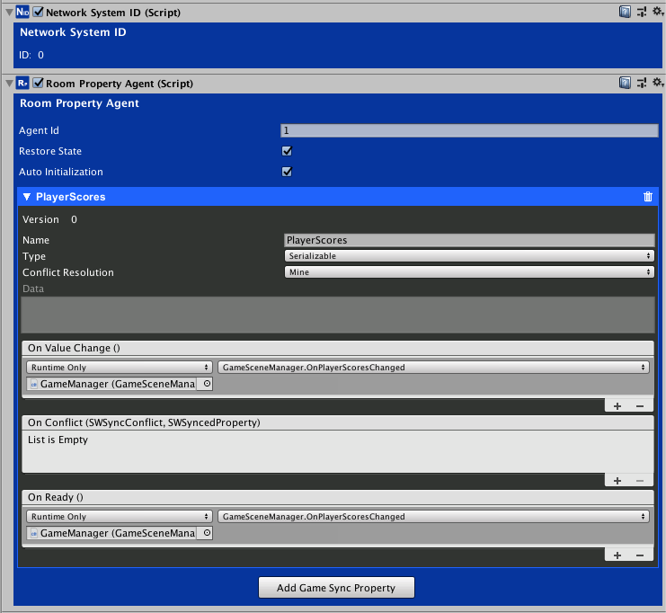
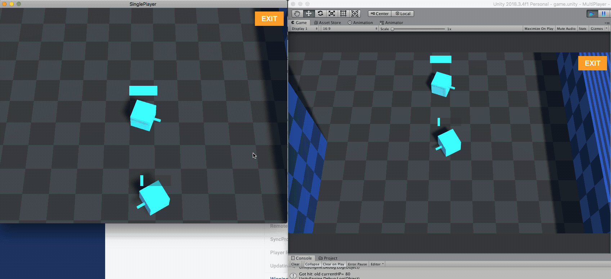

# Winning the Game

<small>5 - 10 minutes read</small>

## Tracking the Bullets Owner

* In the PlayerWeapon.cs script, update the ``FireBullet()`` method and the ``RemoteFire()`` method to send/receive the playerId of the bullet's owner.
``` c#
void FireBullet()
{
    SWNetworkMessage msg = new SWNetworkMessage();
    msg.Push(launchPosition.position);
    msg.Push(transform.forward);
    msg.PushUTF8ShortString(NetworkClient.Instance.PlayerRemoteId);
    remoteEventAgent.Invoke("fire", msg);
}
​
public void RemoteFire(SWNetworkMessage msg)
{
    Vector3 position = msg.PopVector3();
    Vector3 direction = msg.PopVector3();
    string ownerId = msg.PopUTF8ShortString();
    gun.fireBullet(position, direction, ownerId);
}
```
* Add a property to the Bullet.cs script to track its owner.

``` c#
public string ownerId;
```

* Update its OnCollisionEnter method to pass its ownerId to the PlayerHP object.

``` c#
void OnCollisionEnter(Collision collision)
{
    if (collision.gameObject.tag == "Player")
    {
        PlayerHP ps = collision.gameObject.GetComponent<PlayerHP>();
        if (ps != null)
        {
            ps.GotHit(damage, ownerId);
        }
    }
​
    foreach (ContactPoint contact in collision.contacts)
    {
        Debug.Log(contact.thisCollider.name + " hit " + contact.otherCollider.name);
        Instantiate(explode, contact.point, Quaternion.identity);
    }
}
```

* Update the ``FireBullet()`` method of Gun.cs to assign the bullet's owner.

``` c#
public void FireBullet(Vector3 position, Vector3 direction, string ownerId)
{
    GameObject bullet = Instantiate(bulletPrefab) as GameObject;
​
    Bullet b = bullet.GetComponent<Bullet>();
    b.ownerId = ownerId;
​
    bullet.transform.position = position;
    bullet.GetComponent<Rigidbody>().velocity = direction * bulletSpeed;
}
```

## Score

* In the PlayerHP.cs script, update the ``GotHit()`` method to take the ownerId string parameter and call the ``PlayerScored()`` method of GameSceneManager.cs to update the player's score.

``` c#
public void GotHit(int damage, string ownerId)
{
    // Only the source GameObject can modify the "hp" SyncProperty.
    if (networkId.IsMine)
    {
        currentHP = syncPropertyAgent.GetPropertyWithName("hp").GetIntValue();
​
        // Check if the player is already dead.
        if (currentHP == 0)
        {
            return;
        }
​
        Debug.Log("Got hit: bullet owner= " + ownerId);
​
        Debug.Log("Got hit: old currentHP= " + currentHP);
​
        if (currentHP > 0)
        {
            currentHP = currentHP - damage;
​
            // if hp is lower than 0, set it to 0.
            if (currentHP < 0)
            {
                currentHP = 0;
            }
​
            if (currentHP == 0)
            {
                // call the PlayerScored() method if player hp reached 0. 
                // GameSceneManager will update the player's score.
                GameSceneManager gameSceneManager = FindObjectOfType<GameSceneManager>();
                gameSceneManager.PlayerScored(ownerId);
            }
        }
​
        Debug.Log("Got hit: new currentHP= " + currentHP);
​
        // Apply damage and modify the "hp" SyncProperty.
        syncPropertyAgent.Modify("hp", currentHP);
    }
}
```

## Displaying Winner and GameOver Panel

* In the GameSceneManager.cs script, add a method to handle the OnChanged Event for the "PlayerScores" SyncProperty. 



* We look for a score that is larger than 3 and display the Winner/GameOver panel accordingly.

``` c#
public void OnPlayerScoresChanged()
{
    Debug.Log("OnPlayerScoreChanged");
    PlayerScores playerScores = roomPropertyAgent.GetPropertyWithName("PlayerScores").GetValue<PlayerScores>();
    Debug.Log(playerScores);
​
    if(playerScores != null && playerScores.scores != null)
    {
        foreach (Score s in playerScores.scores)
        {
            if(s.score >= 3)
            {
                if (s.playerRemoteId == NetworkClient.Instance.PlayerRemoteId)
                {
                    winnerPanel.gameObject.SetActive(true);
                }
                else
                {
                    gameOverPanel.gameObject.SetActive(true);
                }
                break;
            }
        }
    }
}
```

## Exiting the Room

* Update the ``Exit()`` method in the GameSceneManager.cs script to disconnect and leave the room.

The ``NetworkClient.Instance.DisconnectFromRoom()`` method disconnects the player from the game servers. All the SWNetwork GamePlay components will stop working. 

The ``NetworkClient.Lobby.LeaveRoom()`` method removes the player from its current room in the lobby server. 

``` c#
public void Exit()
{
    NetworkClient.Instance.DisconnectFromRoom();
    NetworkClient.Lobby.LeaveRoom(HandleLeaveRoom);
}
​
void HandleLeaveRoom(bool okay, SWLobbyError error)
{
    if (!okay)
    {
        Debug.LogError(error);
    }
​
    Debug.Log("Left room");
    SceneManager.LoadScene("lobbyScene");
}
```

## Test and Play
!!! success
    Congratulations! You have done the tutorial. 



